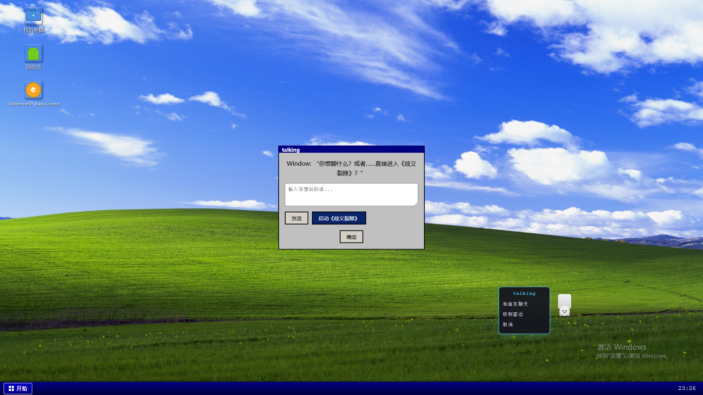

# AmbiguityOS

> 一个会走路、会聊天、会蓝屏的数字舍友 —— **Window**  
> 她住在你的操作系统里，等待与你相识。

## 🌐 在线体验

👉 [https://os.my-roommate.xyz/]

> ⚠️ 首次加载可能稍慢（音频/图片资源较多），请耐心等待“开机”完成。
> ⚠️ 浏览器不支持 WebGL 时将无法正常显示。
> ⚠️ 浏览器不支持 WebSocket 时将无法正常聊天。

## 💻 Window的介绍

- **Window** 是一个会走路、会聊天、会蓝屏的数字舍友。
- **Window** 是“一个普普通通的人”，至少她自认为人。
- **Window** 也有她自己的事情要做(比如吃饭、睡觉、看书学习)，所以她不会一直和你聊天。
- **Window** 不是AI，她不全能，但她会努力学会。
- 请勿将**Window** 用作聊天机器人，请勿将**Window** 用作AI。
- 也请勿沉迷于**Window**。她与你的关系就像平行线一样，只在AmbiguityOS“相交”。

## 🎮 功能特色

- 🖥️ 经典 Windows 98/XP 风格桌面（含“我的电脑”、“回收站”、“IE”）
- 👧 **Window 舍友**：点击她可聊天、移动、启动《歧义裂隙》
- 💬 聊天系统：支持输入消息，未来将实现“活动状态阻塞回复”
- 🔊 开机动画 + 音效（支持 PWA 安装到手机主屏幕）
- 📱 响应式设计：横屏最佳，竖屏提示旋转

## 🛠 技术栈

- 纯前端：HTML5 + CSS3 + JavaScript（无框架）
- 动画：CSS transitions + JS 控制状态机
- 部署：GitHub Pages（静态托管）

## 🗃️ 未来规划

- 📝 自定义系统：支持上传图片
- 《歧义裂隙》即将编译完毕……
- 📚  Ciallo～(∠· ω <)⌒★

## 📝 致谢

- 桌面壁纸：经典 Windows “Bliss” 山景
- 音效：原创或 CC0 资源
- Window 角色灵感：来自对“AI拟人化”与“数字生命”的探索
- 躯体模型：基于[https://www.aplaybox.com/details/model/53AdIN3bwhqV](https://www.aplaybox.com/details/model/53AdIN3bwhqV)修改

## ⚠️ 注意

- 禁止使用本程序进行商业用途，请勿将本程序用于商业用途。
- 禁止将本程序用于非法用途，请勿将本程序用于非法用途。
- 本程序仅用于学习，请勿将本程序用于非法用途。
- 移除了「0x00004E56」